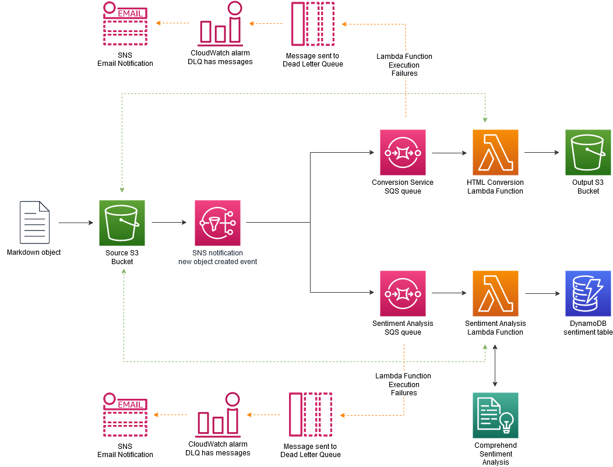
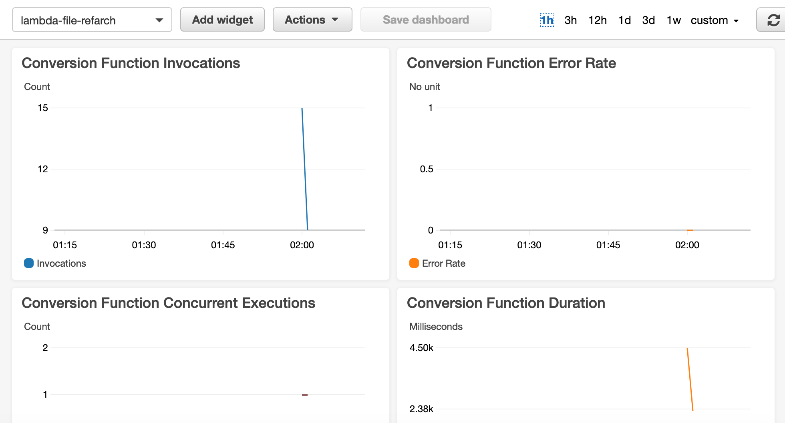

# Serverless Reference Architecture: Real-time File Processing

The Real-time File Processing reference architecture is a general-purpose, event-driven, parallel data processing architecture that uses [AWS Lambda](https://aws.amazon.com/lambda). This architecture is ideal for workloads that need more than one data derivative of an object. 

In this example application, we deliver notes from an interview in Markdown format to S3.  S3 Events are used to trigger multiple processing flows - one to convert and persist Markdown files to HTML and another to detect and persist sentiment.

## Architectural Diagram



## Application Components

### Event Trigger

In this architecture, individual files are processed as they arrive. To achive this, we utilize [AWS S3 Events](https://docs.aws.amazon.com/AmazonS3/latest/dev/NotificationHowTo.html) and [Amazon Simple Notification Service](https://docs.aws.amazon.com/sns/latest/dg/welcome.html). When an object is created in S3, an event is emitted to a SNS topic. We deliver our event to 2 seperate [SQS Queues](https://aws.amazon.com/sqs/), representing 2 different workflows. 
### Conversion Workflow

This function will take Markdown files stored in our **InputBucket**, convert them to HTML, and store them in our **OutputBucket**.  The **ConversionQueue** SQS queue captures the S3 Event JSON payload, allowing for more control of our **ConversionFunction** and better error handling.

If our **ConversionFunction** cannot remove the messages from the **ConversionQueue**, they are sent to **ConversionDlq**, a dead-letter queue (DLQ), for inspection. A CloudWatch Alarm is configured to send notification to an email address when there are any messages in the **ConversionDlq**.

### Sentiment Analysis Workflow

This function will take Markdown files stored in our **InputBucket**, detect the overall sentiment for each file, and store the result in our **SentimentTable**.

We are using [Amazon Comprehend](https://aws.amazon.com/comprehend/) to detect overall interview sentiment.  Amazon Comprehend is a machine learning powered service that makes it easy to find insights and relationships in text. We use the Sentiment Analysis API to understand whether interview responses are positive or negative.

The Sentiment workflow uses the same SQS-to-Lambda Function pattern as the Coversion workflow.

If our **SentimentFunction** cannot remove the messages from the **SentimentQueue**, they are sent to **SentimentDlq**, a dead-letter queue (DLQ), for inspection. A CloudWatch Alarm is configured to send notification to an email address when there are any messages in the **SentimentDlq**.

## Building and Deploying the Application with the AWS Serverless Application Model (AWS SAM)

This application is deployed using the [AWS Serverless Application Model (AWS SAM)](https://aws.amazon.com/serverless/sam/).  AWS SAM is an open-source framework that enables you to build serverless applications on AWS.  It provides you with a template specification to define your serverless application, and a command line interface (CLI) tool.

### Pre-requisites

* [AWS CLI version 2](https://docs.aws.amazon.com/cli/latest/userguide/install-cliv2.html)

* [AWS SAM CLI ](https://docs.aws.amazon.com/serverless-application-model/latest/developerguide/serverless-sam-cli-install.html)

* [Docker](https://docs.docker.com/install/)

### Manually testing

Use the any of the sample-xx.md files in the repository /**tests** directory as example files. After the files have been uploaded, you can see the resulting HTML file in the output bucket of your stack. You can also view the CloudWatch logs for each of the functions in order to see the details of their execution.

You can use the following commands to copy a sample file from the provided S3 bucket into the input bucket of your stack.

```bash
INPUT_BUCKET=$(aws cloudformation describe-stack-resource --stack-name lambda-file-refarch --logical-resource-id InputBucket --query "StackResourceDetail.PhysicalResourceId" --output text)
aws s3 cp ./tests/sample-01.md s3://${INPUT_BUCKET}/sample-01.md
aws s3 cp ./tests/sample-02.md s3://${INPUT_BUCKET}/sample-02.md
```

Once the input files has been uploaded to the input bucket, a series of events are put into motion.

1. The input Markdown files are converted and stored in a separate S3 bucket.
```
OUTPUT_BUCKET=$(aws cloudformation describe-stack-resource --stack-name lambda-file-refarch --logical-resource-id ConversionTargetBucket --query "StackResourceDetail.PhysicalResourceId" --output text)
aws s3 ls s3://${OUTPUT_BUCKET}
```

2. The input Markdown files are analyzed and their sentiment published to a DynamoDB table.
```
DYNAMO_TABLE=$(aws cloudformation describe-stack-resource --stack-name lambda-file-refarch --logical-resource-id SentimentTable --query "StackResourceDetail.PhysicalResourceId" --output text)
aws dynamodb scan --table-name ${DYNAMO_TABLE} --query "Items[*]"
```

Also can view the CloudWatch logs generated by the Lambda functions.


### Using the test script

The pipeline end to end test script can be manually executed, you will need to ensure you have adequate permissions to perform the test script actions.

* Describing stack resources
* Uploading and deleting files from the S3 input bucket
* Deleting files from the S3 output bucket
* Reading and deleting entries from the DynamoDB table

```bash
bash ./tests.sh lambda-file-refarch
```

While the script is executing you will see all the stages output to the command line. The samples are uploaded to the **InputBucket**, the script will then wait for files to appear in the **OutputBucket** before checking they have all been processed and the matching html file exists in the **OutputBucket**. It will also check that the sentiment for each of the files has been recorded in the **SentimentTable**. Once complete  the script will remove all the files created and the entries from the **SentimentTable**.

### Extra credit testing

Try uploading (or adding to ./tests if you are using the script) an oversized (>100MB) or invalid file type to the input bucket.
You can check in X-ray to explore how you can trace these kind of errors within the solution.

* Linux command

```bash
fallocate -l 110M ./tests/sample-oversize.md
```

## Viewing the CloudWatch dashboard

A dashboard is created as a part of the stack creation process.  Metrics are published for the conversion and sentiment analysis processes.  In addition, the alarms and alarm states are published.



## SAM Template Resources

### Resources

[The provided template](https://s3.amazonaws.com/awslambda-reference-architectures/file-processing/packaged-template.yml)
creates the following resources:

- **InputBucket** - A S3 bucket that holds the raw Markdown files. Uploading a file to this bucket will trigger processing functions.

- **NotificationTopic** - A SNS topic that receives S3 events from the **InputBucket**.

- **NotificationTopicPolicy** - A SNS topic policy that allows the **InputBucket** to publish events to the **NotificationTopic**.

- **NotificationQueuePolicy** - A SQS queue policy that allows the **NotificationTopic** to publish events to the **ConversionQueue** and **SentimentQueue**.

- **ApplyS3NotificationLambdaFunction** - A Lambda function that adds a S3 bucket notification when objects are created in the **InputBucket**.  The function is called by **ApplyInputBucketTrigger**.

- **ApplyInputBucketTrigger** - A CloudFormation Custom Resource that invokes the **ApplyS3NotificationLambdaFunction** when a CloudFormation stack is created.

- **ConversionSubscription** - A SNS subscription that allows the **ConversionQueue** to receive messages from **NotificationTopic**.

- **ConversionQueue** - A SQS queue that is used to store events for conversion from Markdown to HTML.

- **ConversionDlq** - A SQS queue that is used to capture messages that cannot be processed by the **ConversionFunction**.  The *RedrivePolicy* on the **ConversionQueue** is used to manage how traffic makes it to this queue.

- **ConversionFunction** - A Lambda function that takes the input file, converts it to HTML, and stores the resulting file to **ConversionTargetBucket**.

- **ConversionTargetBucket** - A S3 bucket that stores the converted HTML.

- **SentimentSubscription** - A SNS subscription that allows the **SentimentQueue** to receive messages from **NotificationTopic**.

- **SentimentQueue** - A SQS queue that is used to store events for sentiment analysis processing.

- **SentimentDlq** - A SQS queue that is used to capture messages that cannot be processed by the **SentimentFunction**.  The *RedrivePolicy* on the **SentimentQueue** is used to manage how traffic makes it to this queue.

- **SentimentFunction** - A Lambda function that takes the input file, performs sentiment analysis, and stores the output to the **SentimentTable**.

- **SentimentTable** - A DynamoDB table that stores the input file along with the sentiment.

- **AlarmTopic** - A SNS topic that has an email as a subscriber.  This topic is used to receive alarms from the **ConversionDlqAlarm**, **SentimentDlqAlarm**, **ConversionQueueAlarm**, **SentimentQueueAlarm**, **ConversionFunctionErrorRateAlarm**, **SentimentFunctionErrorRateAlarm**, **ConversionFunctionThrottleRateAlarm**, and **SentimentFunctionThrottleRateAlarm**.

- **ConversionDlqAlarm** - A CloudWatch Alarm that detects when there there are any messages sent to the **ConvesionDlq** within a 1 minute period and sends a notification to the **AlarmTopic**.

- **SentimentDlqAlarm** - A CloudWatch Alarm that detects when there there are any messages sent to the **SentimentDlq** within a 1 minute period and sends a notification to the **AlarmTopic**.

- **ConversionQueueAlarm** - A CloudWatch Alarm that detects when there are 20 or more messages in the **ConversionQueue** within a 1 minute period and sends a notification to the **AlarmTopic**.

- **SentimentQueueAlarm** - A CloudWatch Alarm that detects when there are 20 or more messages in the **SentimentQueue** within a 1 minute period and sends a notification to the **AlarmTopic**.

- **ConversionFunctionErrorRateAlarm** - A CloudWatch Alarm that detects when there is an error rate of 5% over a 5 minute period for the **ConversionFunction** and sends a notification to the **AlarmTopic**.

- **SentimentFunctionErrorRateAlarm** - A CloudWatch Alarm that detects when there is an error rate of 5% over a 5 minute period for the **SentimentFunction** and sends a notification to the **AlarmTopic**.

- **ConversionFunctionThrottleRateAlarm** - A CloudWatch Alarm that detects when ther is a throttle rate of 1% over a 5 minute period for the **ConversionFunction** and sends a notification to the **AlarmTopic**.

- **SentimentFunctionThrottleRateAlarm** - A CloudWatch Alarm that detects when ther is a throttle rate of 1% over a 5 minute period for the **SentimentFunction** and sends a notification to the **AlarmTopic**.

- **ApplicationDashboard** - A CloudWatch Dashboard that displays Conversion Function Invocations, Conversion Function Error Rate, Conversion Function Throttle Rate, Conversion DLQ Length, Sentiment Function Invocations, Sentiment Function Error Rate, Sentiment Function Throttle Rate, and Sentiment DLQ Length.

## License

This reference architecture sample is licensed under Apache 2.0.
